# cChess
Computer Vision and Machine Learning Application to Chess

# Deep Learning
## Confusion Matrix on Pieces Classifciation with Fine-Tuning of VGG16
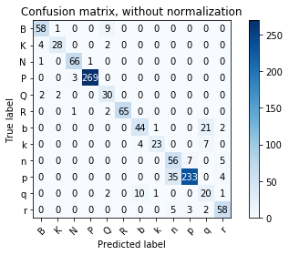

### Test on Never Seen Data (White Knight Classification)
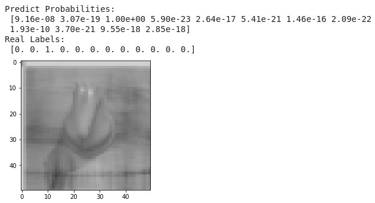

## 
 <i> Blender Render (Train Models)

Model          |  Fancy Rendering
:-------------------------:|:-------------------------:
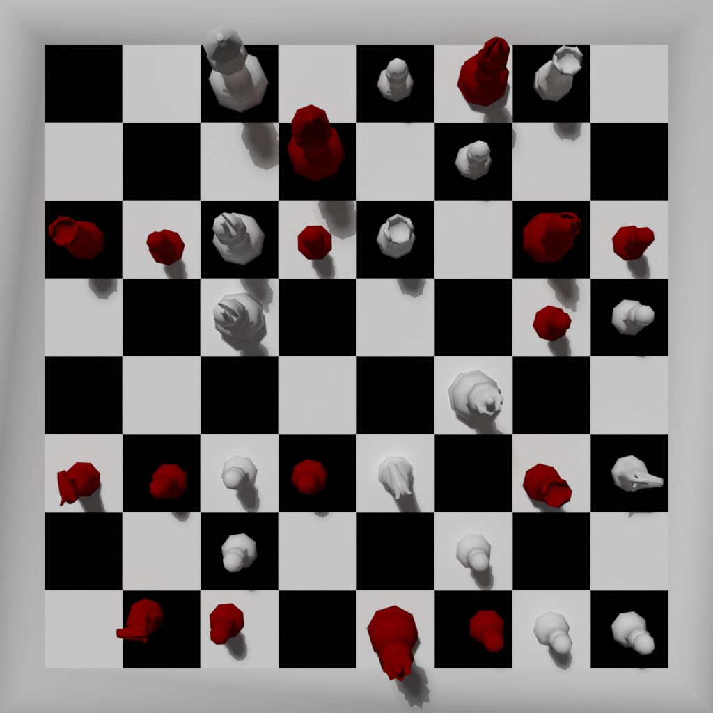|  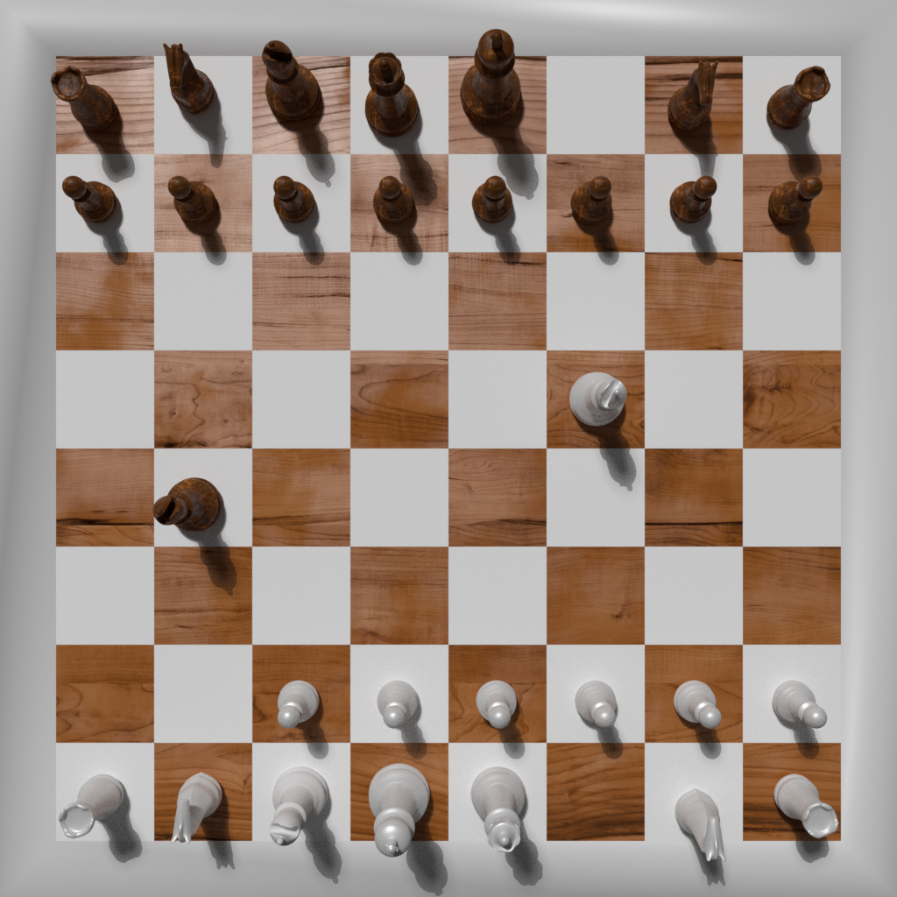

# Computer Vision

## 
 <i> Piece Detection

Original             |  Hot/Gray
:-------------------------:|:-------------------------:
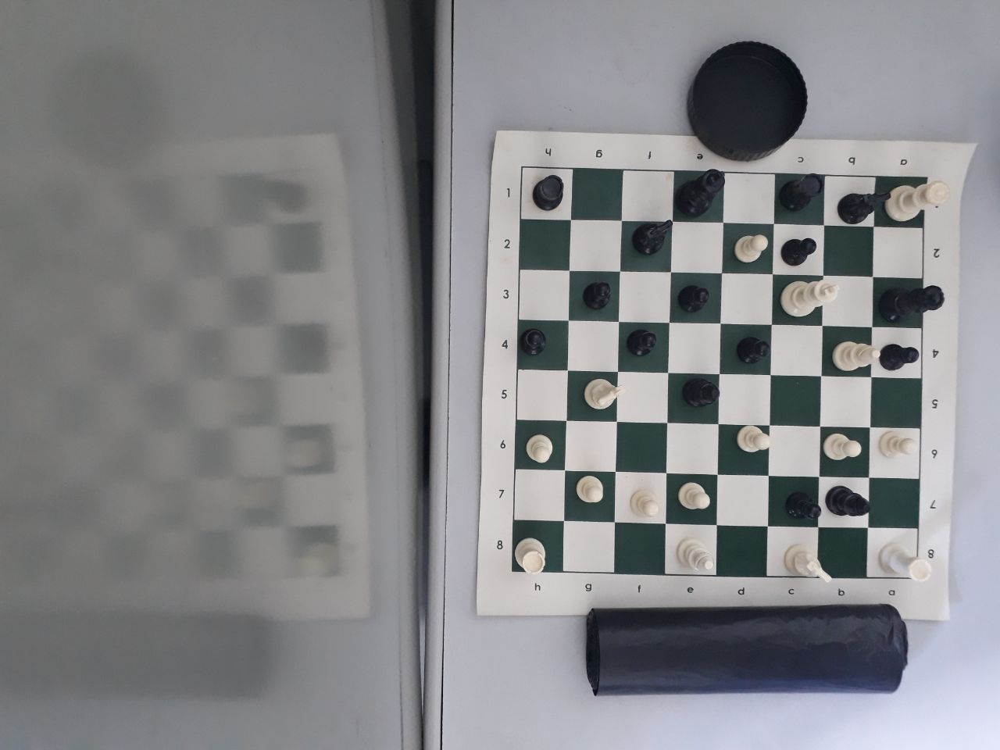 |  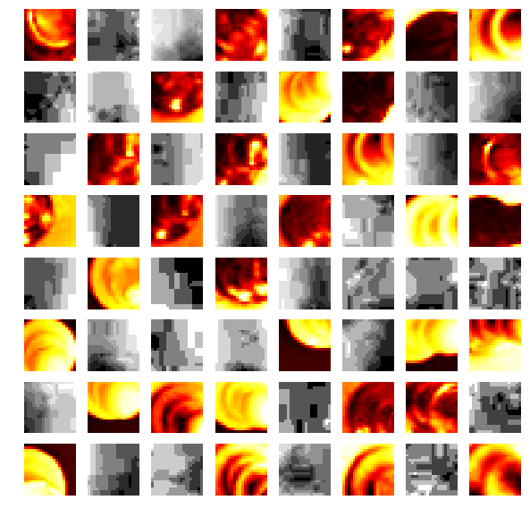

## 
 <i> Computer Vision From Start Position 
 

Real World             |  Computer Vision
:-------------------------:|:-------------------------:
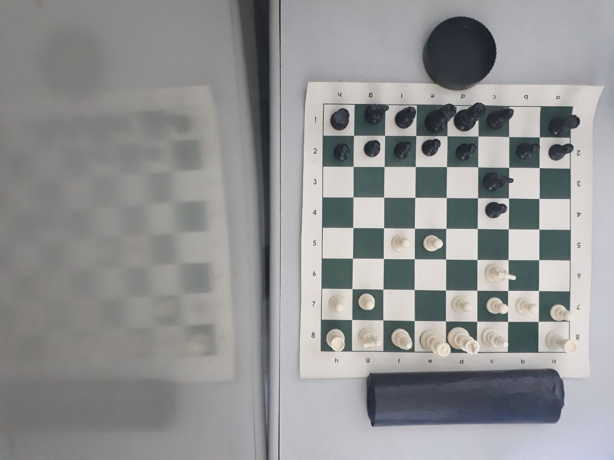 |  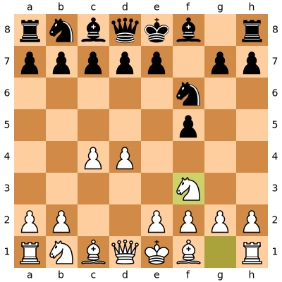

Real World             |  Computer Vision
:-------------------------:|:-------------------------:
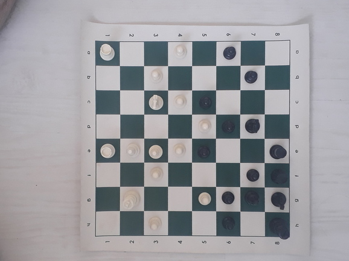 |  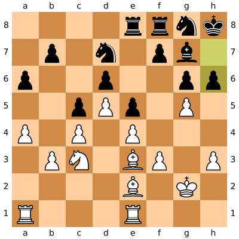

## 
 <i> Engine Scores

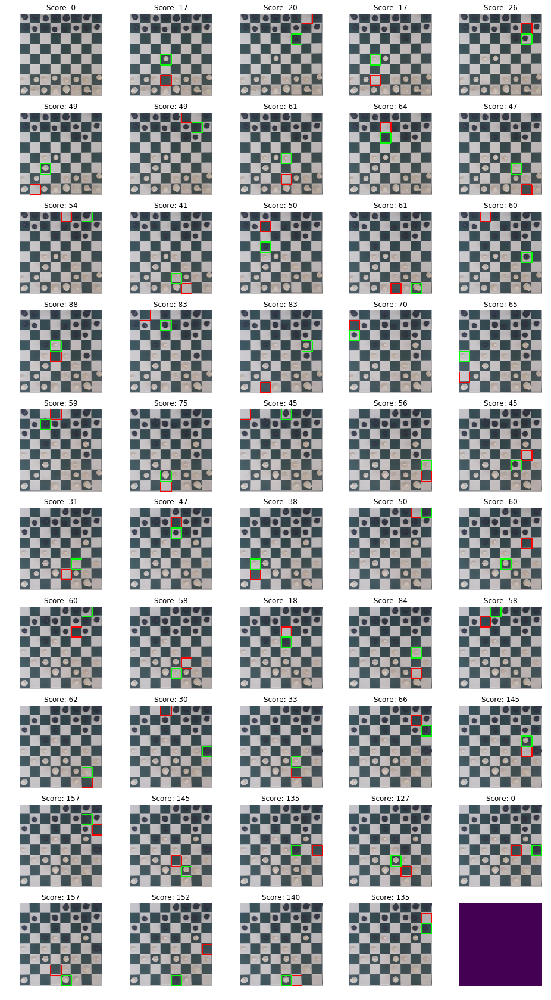
