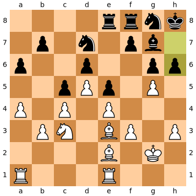

# cChess
Computer Vision and Machine Learning Application to Chess

# Deep Learning

## 
 <i> Blender Scenes (Train Models)

## 
 <i> Blender Scenes with some fancy rendering (Train Models)

# Computer Vision

## 
 <i> Piece Detection

Original             |  Hot/Gray
:-------------------------:|:-------------------------:
 |  

## 
 <i> Computer Vision From Start Position 
 

Real World             |  Computer Vision
:-------------------------:|:-------------------------:
 |  

Real World             |  Computer Vision
:-------------------------:|:-------------------------:
 |  

## 
 <i> Engine Scores

